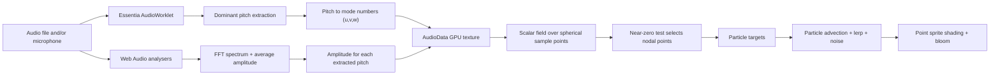

# Previous Architecture: Main-Branch Cymatic Particle System

This note documents the previous architecture that existed on the historical `main` branch of Baryon before the current package-based visualizer work.

It is specifically about the older particle system that continuously morphed into new spherical cymatic shapes in response to live audio or uploaded audio.

## Summary

The previous architecture did not simulate a flat cymatics plate. It rendered a 3D particle sculpture inside a sphere and continuously re-targeted that sculpture toward the nodal structure of a standing-wave scalar field derived from audio.

In practice, the result was:

- a black full-screen scene
- a dense cloud of roughly 1.5 million particles
- constant reconfiguration into new spherical cymatic-like forms as pitch changed
- louder audio causing stronger pulsation and larger particle sprites
- a slow global Y-axis rotation
- holographic blue shading with bloom and additive blending

At very low amplitude or silence, the system fell back toward a Baryon logo point cloud instead of remaining in a cymatic state.

## High-Level Flow

## Runtime Entry Point

The main React entry was [`src/three/components/ThreeScene.jsx`](https://github.com/BaryonOfficial/Baryon/blob/main/src/three/components/ThreeScene.jsx), which mounted a full-screen canvas and attached audio controls.

The full render pipeline was orchestrated by [`src/three/scene/useThreeScene.js`](https://github.com/BaryonOfficial/Baryon/blob/main/src/three/scene/useThreeScene.js):

- scene, camera, renderer, and controls were created
- audio was initialized
- the GPGPU textures and particle renderer were created
- each animation frame processed audio, ran GPU compute passes, updated particle targets, rotated the result, and rendered the final frame

## Scene Setup

The visual framing was simple and deliberate:

- black background
- perspective camera at `(0, 3, 20)`
- orbit controls
- post-processing bloom

This came from [`src/three/scene/setupScene.js`](https://github.com/BaryonOfficial/Baryon/blob/main/src/three/scene/setupScene.js) and [`src/three/postProcessing/postProcessingSetup.js`](https://github.com/BaryonOfficial/Baryon/blob/main/src/three/postProcessing/postProcessingSetup.js).

Important defaults:

- particle count: `1,500,000`
- sphere radius: `3.0`
- zero-point threshold: `0.05`
- surface ratio: `0.33`
- surface shell tolerance: `0.01`
- bloom strength: `0.36`
- bloom threshold: `0.4`

## Audio Architecture

The previous architecture combined two audio paths in [`src/core/audio/audioSetup.js`](https://github.com/BaryonOfficial/Baryon/blob/main/src/core/audio/audioSetup.js):

1. `THREE.AudioAnalyser`
2. an `AudioWorkletNode` backed by Essentia

The analyser path produced:

- average amplitude
- FFT frequency magnitudes

The worklet path produced:

- a dominant pitch estimate using Essentia `PredominantPitchMelodia`

The historical worklet implementation lived in `public/lib/audio-data-processor.js` in the pre-monorepo tree.

### What the worklet actually extracted

The worklet buffered audio in 4096-sample windows, ran pitch detection, converted the frame-wise pitch track into a single mean voiced pitch, and wrote that pitch into the shared ring buffer.

That matters because the visual system looked like a multi-mode cymatic field, but in the previous architecture it was largely driven by one dominant pitch estimate at a time, plus the FFT amplitude lookup associated with that pitch.

## GPU Compute Architecture

The old system used `GPUComputationRenderer` in [`src/core/gpgpuSetup.js`](https://github.com/BaryonOfficial/Baryon/blob/main/src/core/gpgpuSetup.js) to run four linked textures:

1. `uAudioData`
2. `uScalarField`
3. `uZeroPoints`
4. `uParticles`

Each compute stage transformed the result of the previous one.

### 1. Base sampling domain

The system started with a spherical point distribution:

- about one-third of samples on the sphere surface
- the rest distributed through the sphere volume

Those sample positions were stored in the base texture and became the evaluation domain for the scalar field.

This is one reason the output always read as a spherical cymatic object rather than a 2D plate pattern.

### 2. AudioData pass

The shader in [`src/three/shaders/gpgpu/audioData.glsl`](https://github.com/BaryonOfficial/Baryon/blob/main/src/three/shaders/gpgpu/audioData.glsl) converted extracted pitch into mode numbers and paired those mode numbers with a sampled amplitude.

It did three main things:

1. read a pitch from the Essentia output texture
2. convert that pitch into mode numbers `(u, v, w)`
3. sample FFT amplitude at the corresponding frequency bin

The output texture stored:

- `rgb`: the integer-like mode numbers
- `a`: the amplitude associated with that pitch

### 3. Pitch-to-mode mapping

The previous architecture estimated normal modes using a cavity-style formula:

`f = (c / 2L) * ||n||`

Where:

- `c` was the speed of sound in air, fixed at `340.0`
- `L` was the visualizer sphere radius
- `n` was a 3-vector of mode numbers

The shader first tried a secant-style solve and then fell back to a bisection method if the result looked unreasonable.

This means the older system was not looking up a curated library of physically validated cymatic modes. It was inferring modal indices from pitch on the GPU every frame.

## Scalar Field Construction

The actual cymatic form came from [`src/three/shaders/gpgpu/scalarField.glsl`](https://github.com/BaryonOfficial/Baryon/blob/main/src/three/shaders/gpgpu/scalarField.glsl).

For each sample position inside the sphere, the shader evaluated a summed field of the form:

`sum += Ai * sin(ui * pi * x / R) * sin(vi * pi * y / R) * sin(wi * pi * z / R)`

Where:

- `Ai` was the amplitude taken from the audio-driven texture
- `(ui, vi, wi)` were the mode numbers inferred from pitch
- `R` was the configured sphere radius

The important point is that the visible shape was not the whole field. The visible shape came from the field's near-zero set.

## Zero-Point Extraction

The shader in [`src/three/shaders/gpgpu/zeroPoints.glsl`](https://github.com/BaryonOfficial/Baryon/blob/main/src/three/shaders/gpgpu/zeroPoints.glsl) selected particles where:

`abs(scalarValue) < threshold`

With the default threshold at `0.05`, these retained points approximated nodal surfaces or nodal volumes of the standing-wave field.

This is the core reason the particles appeared to form cymatic structures:

- the scalar field changed as pitch changed
- the near-zero regions changed with it
- the particles were always being retargeted toward the newly selected zero-set

The same shader also classified points into two visual groups:

- surface particles: points close to the sphere shell
- volume particles: points inside the shell

At low amplitude, the shader switched away from the scalar field and sampled the Baryon logo texture instead. This produced the old fallback behavior where the sculpture relaxed into branding when sound energy was too low.

## Why The Shapes Were Constantly Morphing

The older system was designed around continuous retargeting, not static mode locking.

Three mechanisms caused the constant morphing:

1. The dominant pitch estimate changed over time.
2. The amplitude attached to that pitch changed over time.
3. The particle simulation never teleported instantly to a new stable state. It flowed toward the new nodal targets with interpolation and noise.

So even when the rendered object looked like a coherent spherical cymatic form, it was almost always in transition between one nodal configuration and the next.

That behavior was implemented in [`src/three/shaders/gpgpu/particles.glsl`](https://github.com/BaryonOfficial/Baryon/blob/main/src/three/shaders/gpgpu/particles.glsl).

## Particle Motion Model

The particle compute stage did not simply pin each particle to a node. It combined:

- attraction toward the current target point
- simplex-noise flow-field motion
- distance-based smoothing and damping

The target was chosen as:

- current zero-point position while audio was active
- Baryon logo position when amplitude was effectively zero

This made the object feel alive rather than rigid. The visual effect was less like frozen mode geometry and more like a glowing particulate body continuously reorganizing itself into successive cymatic shells, lobes, tunnels, and voids.

## Final Particle Rendering

The render material in [`src/core/particlesSetup.js`](https://github.com/BaryonOfficial/Baryon/blob/main/src/core/particlesSetup.js), [`src/three/shaders/particles/vertex.glsl`](https://github.com/BaryonOfficial/Baryon/blob/main/src/three/shaders/particles/vertex.glsl), and [`src/three/shaders/particles/fragment.glsl`](https://github.com/BaryonOfficial/Baryon/blob/main/src/three/shaders/particles/fragment.glsl) turned the compute output into the final look.

### Geometry and draw style

- rendered as `THREE.Points`
- additive blending
- circular point sprites
- particle positions read from the particle simulation texture

### Color language

Default colors were:

- volume color: `#0586ff`
- surface color: `#DEF0FA`
- background: black

Surface particles read as pale icy blue. Interior particles read as stronger electric blue.

### Motion and pulsation

The vertex shader pushed particles outward along their local normal based on average amplitude and scaled point size with that same pulsation. This made louder audio look more inflated and more luminous.

### Holographic finish

The fragment shader layered in:

- Fresnel edge lighting
- animated horizontal stripe bands
- blue-to-cyan holographic mixing

This gave the previous architecture its distinctive "energy object" look rather than a plain scientific point cloud.

## Expected Visual Output

The expected visual output of the previous architecture was:

- a rotating, glowing, holographic particle sphere
- continuously morphing nodal structures rather than a fixed mesh
- a mixture of shell-like and interior formations
- denser, brighter regions where the nodal target field concentrated particles
- constant transitional motion even when the overall form seemed stable

When audio characteristics changed, viewers would typically perceive:

- low or steady tones producing simpler symmetric lobes
- changing pitch producing rapid reorganization into a new spherical pattern
- stronger amplitude producing more pulsation and larger point sprites
- silence causing the cymatic form to collapse back toward the logo fallback

## Controls That Shaped The Look

The old debug GUI in [`src/three/gui/guiSetup.js`](https://github.com/BaryonOfficial/Baryon/blob/main/src/three/gui/guiSetup.js) exposed the main artistic controls:

- bloom enable, strength, radius, threshold
- background, volume, and surface colors
- flow-field influence, strength, and frequency
- particle speed
- target lerp threshold
- zero-point precision threshold
- particle size
- rotation speed
- surface-particle toggle
- movement mode

These controls did not change the core architecture. They tuned how sharply the nodal field was sampled and how fluidly particles reorganized into the next spherical cymatic state.

## Architectural Characteristics

This previous architecture had a few defining traits:

- GPU-first: almost all geometric transformation happened in compute shaders
- audio-reactive but not physically strict: the system visually suggested cymatics rather than reproducing a lab-accurate physical apparatus
- continuous-state rendering: particles were always en route to a target, not just statically displaying one
- spherical domain: patterns existed in a 3D volume and on a 3D shell, not on a flat resonant plate
- branding fallback: silence transitioned to the Baryon logo

## Limitations Of The Previous Architecture

The old design was effective visually, but it had important limitations:

- the pitch model was mostly dominant-pitch driven, not a full harmonic mode decomposition
- the modal solve was heuristic and GPU-based, not a curated or validated mode library
- the visualizer implied "cymatics" broadly, but the output was better described as a stylized spherical nodal-field visualization
- stability depended on thresholds and particle-flow tuning as much as on the underlying field

## Historical Positioning

This document describes the previous architecture only.

It should be used as reference for:

- understanding the original `main`-branch cymatic visualizer
- comparing the older GPU field pipeline against the current visualizer architecture
- preserving the intended visual behavior of the constantly morphing spherical cymatic particle system

It should not be treated as documentation for the current implementation in `packages/visualizer`.
